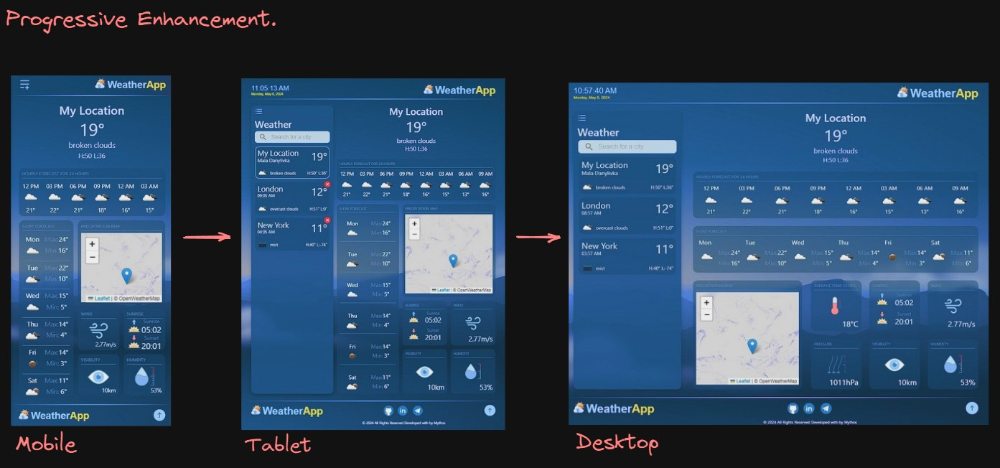

WEATHER-APP

This application automatically detects your geolocation and shows a detailed weather forecast. You can choose your own location and receive a detailed weather forecast.
The app shows the current temperature, as well as sunrise and sunset times according to your city's time zone. You can view complete hourly climate information, including expected changes over the next 6 days.

Frontend:

1. React, react-router-dom, hooks, PropTypes, react-transition-group.
2. Axios.
3. Rest-API.
4. @emotion/styled.
5. Progressive Enhancement.
6. Mobile(up to 480px responsive), tablet and desktop adaptive design.
7. CSS Grid.

Backend:

https://openweathermap.org/